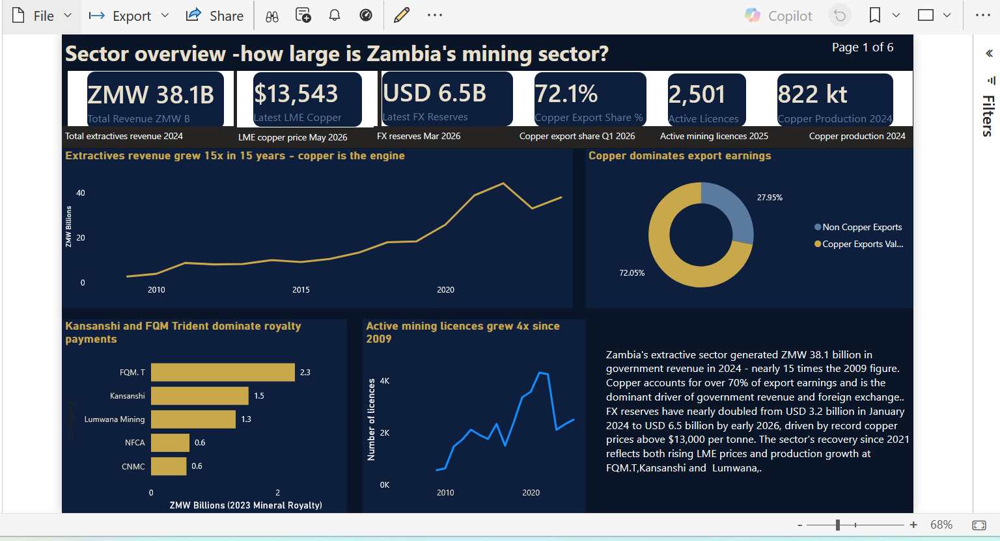
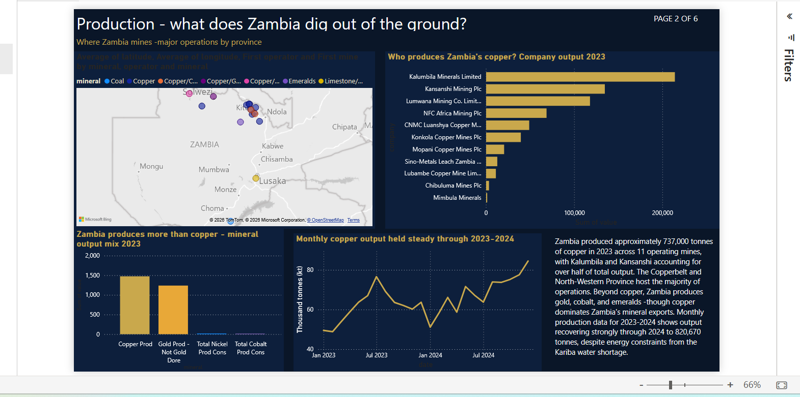
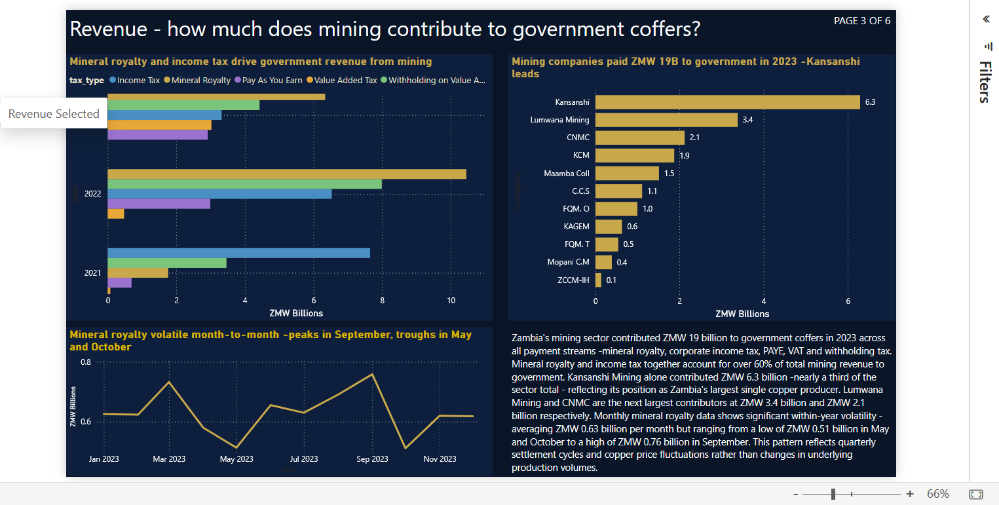
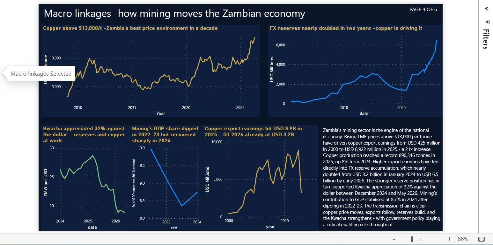
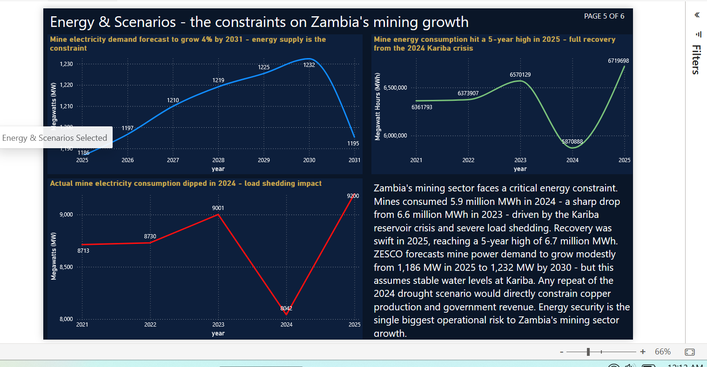
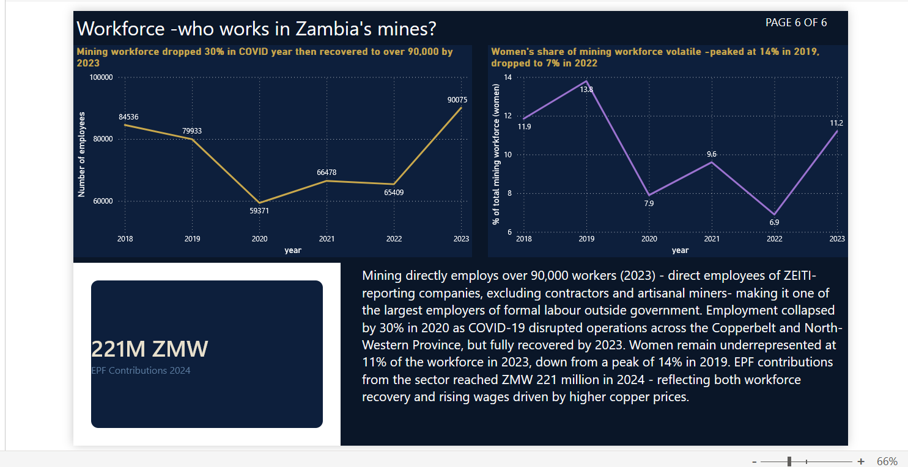
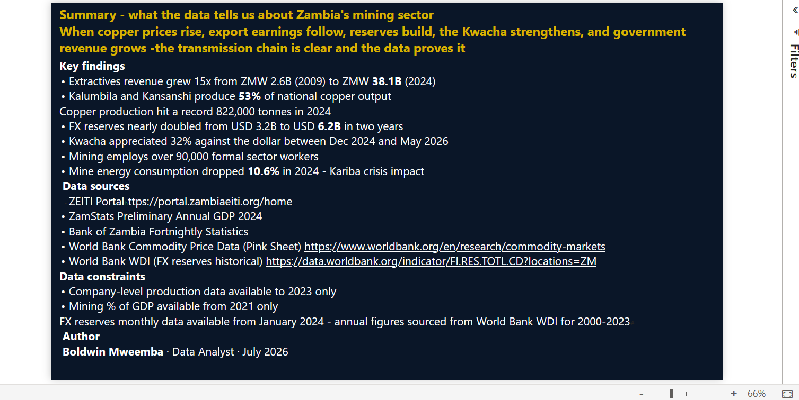

# Zambia Mining Sector Performance Report 2026

A Power BI analytical report examining Zambia's mining sector across six dimensions - production, revenue, fiscal contribution, macroeconomic linkages, energy constraints, and workforce — using verified data from ZEITI, ZamStats, Bank of Zambia, and the World Bank.

## The verdict

**Copper prices drive export earnings, reserves, the Kwacha, and government revenue - the transmission chain is clear and the data proves it.**

## Report structure

- **Sector Overview** — KPI cards, revenue trend, top royalty payers, licence pipeline, copper export dominance
- **Production** — Mine locations map, copper output by company, monthly production trend, mineral mix
- **Revenue** — Revenue by tax type, company payments to government, payments to agencies, monthly royalty trend
- **Macro Linkages** — LME copper price, FX reserves, ZMW/USD exchange rate, copper exports, mining % of GDP
- **Energy & Scenarios** — ZESCO actual mine loads, mine energy consumption, electricity demand forecast 2025–2031
- **Workforce** — Total employment trend, women in mining, EPF contributions
- **Summary** — Verdict, key findings, data sources, constraints, author

## Live report

👉 [View the interactive report on Power BI](https://app.powerbi.com/view?r=eyJrIjoiMzkxY2RiNTMtODZkMS00MzRmLTkzNjQtMGM0MGY2YTNiYzMzIiwidCI6IjRmMWIzZGUzLWNlNTItNDRjNC1iNjZjLTdiNjExNDQzMmE1ZCJ9)

## Preview

### Sector Overview

### Production

### Revenue

### Macro Linkages

### Energy & Scenarios

### Workforce

### Summary

## Key findings

- Extractives revenue grew 15x from ZMW 2.6B (2009) to ZMW 38.1B (2024)
- Kalumbila and Kansanshi produce 52% of national copper output (2023)
- Copper production hit a record 822,000 tonnes in 2024 - up from 737,000 in 2023
- FX reserves nearly doubled from USD 3.2B (Jan 2024) to USD 6.2B (Mar 2026)
- Kwacha appreciated 32% against the dollar between December 2024 and May 2026
- Mining directly employs 90,075 workers (2023) — direct employees of ZEITI-reporting companies
- Mine energy consumption dropped 10.6% in 2024 due to the Kariba reservoir crisis
- Mineral royalty and income tax account for over 60% of mining revenue to government

## Data sources

| Source | Link |
|---|---|
| ZEITI Portal | https://portal.zambiaeiti.org/home |
| ZEITI General Reports | https://zambiaeiti.org/general-reports/ |
| ZamStats Preliminary Annual GDP 2024 | https://www.zamstats.gov.zm |
| Bank of Zambia Fortnightly Statistics | https://www.boz.zm/statistics.htm |
| World Bank Commodity Price Data (Pink Sheet) | https://www.worldbank.org/en/research/commodity-markets |
| World Bank WDI — FX Reserves | https://data.worldbank.org/indicator/FI.RES.TOTL.CD?locations=ZM |

## Data constraints

- Company-level production data available to 2023 only (ZEITI portal)
- Mining % of GDP available from 2021 only (ZamStats)
- FX reserves monthly data available from January 2024 — annual figures sourced from World Bank WDI for 2000–2023
- ASM production data unavailable from ZEITI portal
- Map visual requires Azure Maps — pending organisational admin approval

## Data folder

The `data/` folder contains 13 cleaned CSV files used to build the report. Raw data was sourced from the ZEITI portal and other sources listed above, then cleaned and structured using Python (pandas).

## How to open

Requires Power BI Desktop (free download from Microsoft). Open the `.pbix` file and navigate using the page tabs at the bottom. Alternatively view the live report using the link above — no Power BI account required.

## Related projects

| Project | Description |
|---|---|
| [Zambia Macroeconomic Recovery 2015–2025](https://github.com/BoldwinMax/Zambia-Macroeconomic-Recovery-2015-2025) | Power BI report examining whether Zambia's recovery was driven by copper prices or the 2023 debt restructuring deal |
| [Zambia Energy Security Risk Model](https://github.com/BoldwinMax/Zambia-Energy-Security-Risk-Model) | Links Kariba reservoir levels, El Niño cycles, and load-shedding risk (2000–2025) |
| [Electoral Uncertainty and Exchange Rate Dynamics in Zambia](https://github.com/BoldwinMax/Electoral-Uncertainty-and-Exchange-Rate-Dynamics-in-Zambia) | Event-study analysis of ZMW/USD responses to Zambian elections 2006–2021 |

## Author

**Boldwin Mweemba**
Data Analyst ·  Lusaka, Zambia
MSc mathematical sciences 
GitHub: [BoldwinMax](https://github.com/BoldwinMax) · LinkedIn: [linkedin.com/in/boldwin-mweemba](https://linkedin.com/in/boldwin-mweemba)
July 2026
